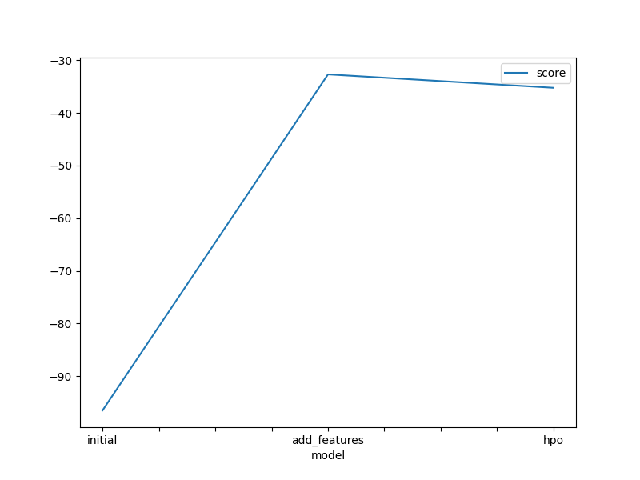

# Report: Predict Bike Sharing Demand with AutoGluon Solution
#### Abdulkarim Hussein

## Initial Training
### What did you realize when you tried to submit your predictions? What changes were needed to the output of the predictor to submit your results?
Round negative outputs to zero

### What was the top ranked model that performed?
After doing EDA and adding new features, here was my top ranked model which is
predictor_new_features.get_model_best() => 'WeightedEnsemble_L3'

## Exploratory data analysis and feature creation
### What did the exploratory analysis find and how did you add additional features?
I think the most important features are features related to 'datetime' which is enterd as one string to the model, so I extracted 5 columns from 'datetime' => {years, months, days, hours, day_of_week}.

### How much better did your model preform after adding additional features and why do you think that is?
The model before EDA didn't know which day in the week is 'like Sat, Mon, ..' in real-life it's matter if the day is a working day or not and we could optmize our model by adding public holidays, and I spearated 'years, months, days, hours' because each one of them means somthing like 9am is definitely not like 3am were every one is sleep.

## Hyper parameter tuning
### How much better did your model preform after trying different hyper parameters?
Unfortunatel, after doing hyper parameter tuning I did not find significant improvments, and the score was very close to the model without hpo.

### If you were given more time with this dataset, where do you think you would spend more time?
I'll spend more time on feature engineering and EDA, and on hyper parameter tuning since I did not get better results after doing it.

### Create a table with the models you ran, the hyperparameters modified, and the kaggle score.
|model|presets|num_trials|NN_options|score|
|--|--|--|--|--|
|initial|best_quality|-|-|1.36521|
|add_features|best_quality|-|-|0.41484|
|hpo|best_quality|30|num_epochs, learning_rate, activation, layers, dropout_prob|0.54973|

### Create a line plot showing the top model score for the three (or more) training runs during the project.

TODO: Replace the image below with your own.

### Create a line plot showing the top kaggle score for the three (or more) prediction submissions during the project.

TODO: Replace the image below with your own.

## Summary
TODO: Add your explanation
